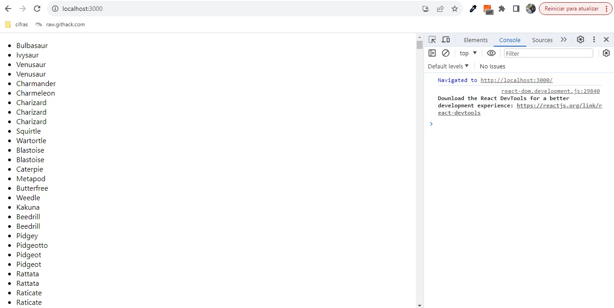
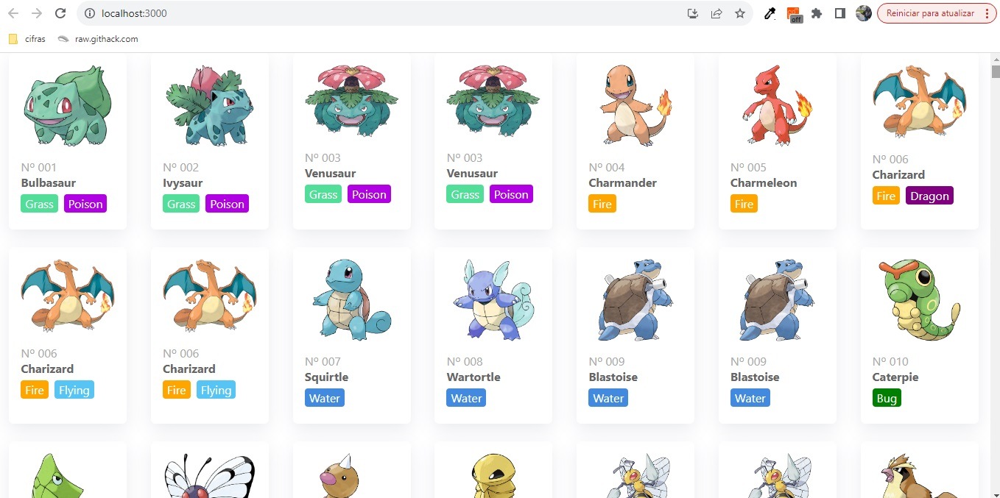
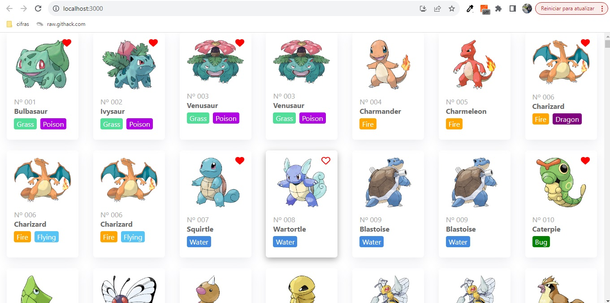
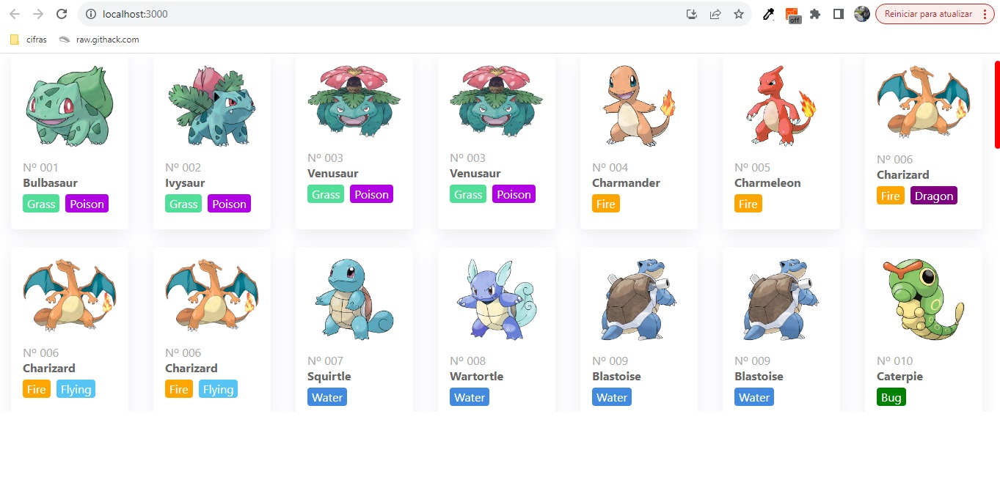
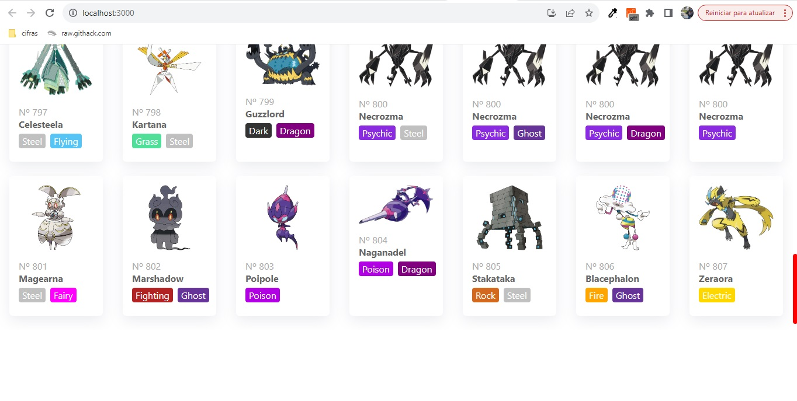
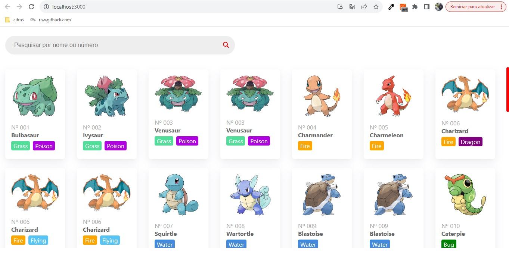
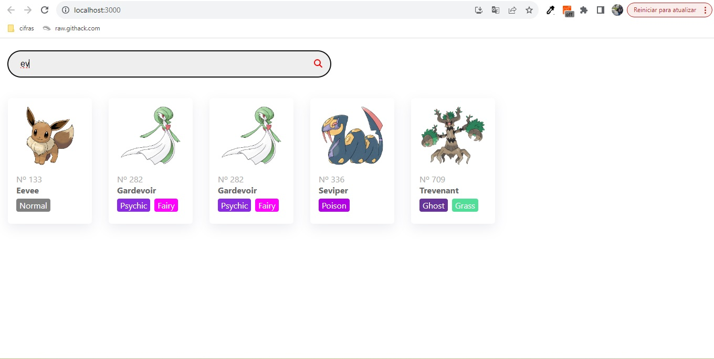

# Teste Synvia Pokedex - Iara Nascimento Sztybe

Esse projeto foi iniciado dia 03/11/2023, às 21h.

### Comandos

- `npm start`: modo desenvolvedor na porta 3000;
- `npm test`: roda os testes;
- `npm run build`: constrói a versão de produção na pasta build.

### Ações iniciais

- Projeto gerado com o comando `npx create-react-app synvia-pokedex`.
- Styled Components instalado com o comando `npm install styled-components --save`.
- Comandos do projeto listados no README.
- Configuração do projeto no GitHub e no Vercel.

### Etapa 1 - Lista

Para construir as funcionalidades da primeira etapa, foram feitas as ações abaixo.

- Axios instalado com o comando `npm install axios --save`.
- Foi criada a pasta "components" e, na mesma, o componente de lista (List.js).
- O componente de App.js foi refatorado para importar a lista.
- A requisição com axios para URL solicitada no projeto foi adicionada na lista.

- Foi criado um componente de exibição de pokemon para a listagem (Pokemon.js).
- Para completar a exibição, foi criado o componente de marcação de tipo (Type.js).

Aqui notei que alguns pokemons não estão exibindo a imagem e que alguns estão duplicados por conta do tipo. Então mais pra frente vou tentar ver uma forma de tratar isso, primeiramente vou tentar finalizar o desafio a tempo.

- Para fazer a mecânica de favorito, decidi utilizar redux na persistência de dados. Então instalei a biblioteca com o comando `npm install react-redux --save`.
- Redux aplicado para a listagem de pokemons já com a funcionalidade de favoritar.
- Foram adicionadas bibliotecas de icones do font-awesome.

- Estilizado barra de rolagem da listagem

### Etapa 2 - Filtros

- Criando componente de busca com campo de entrada que filtra os pokemons por nome ou número (Search.js).
- Adicionando filtros no redux e fazendo a busca pelo nome ou número do pokemon.

