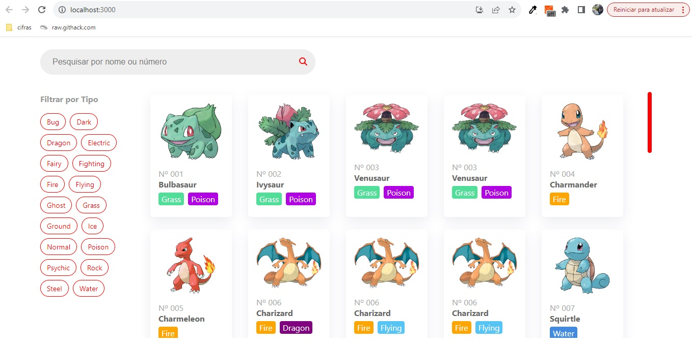
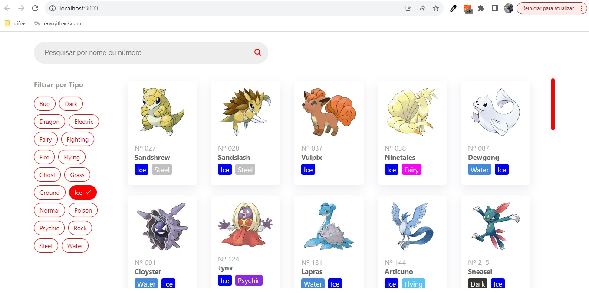
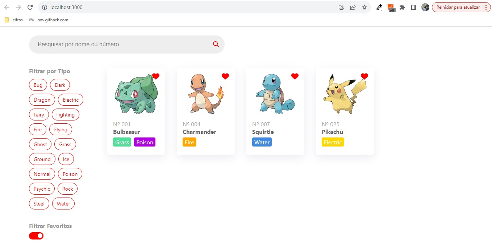
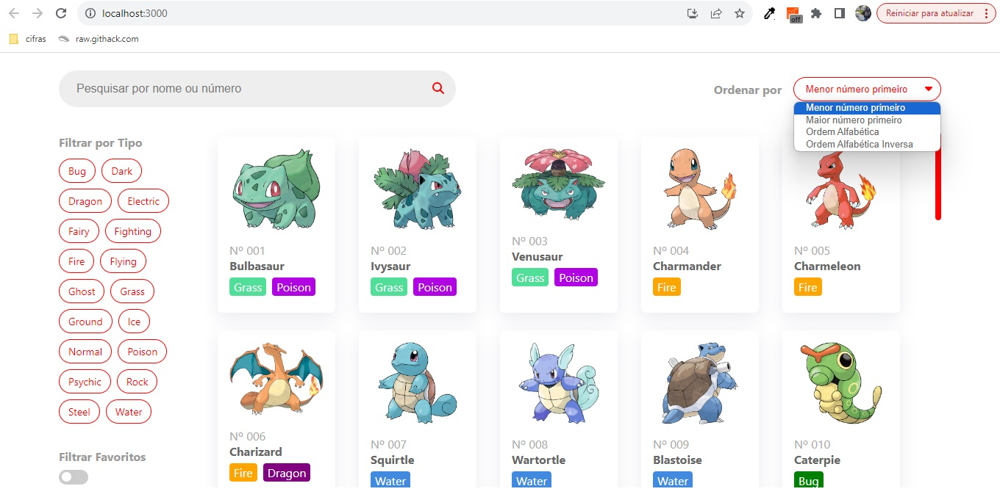
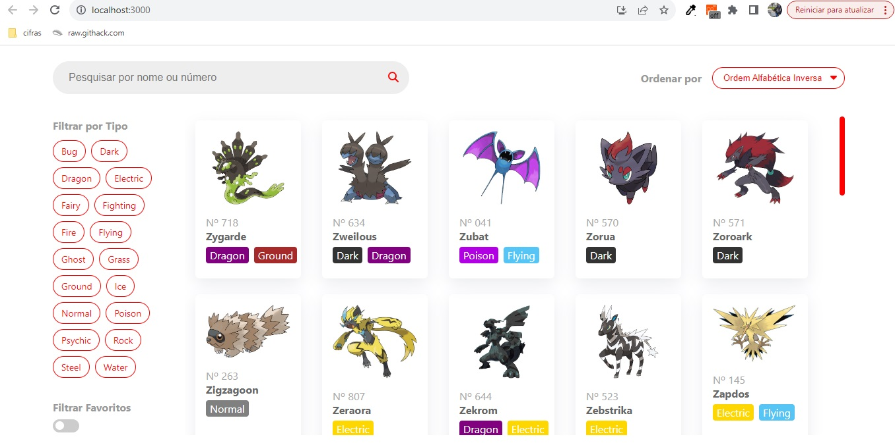
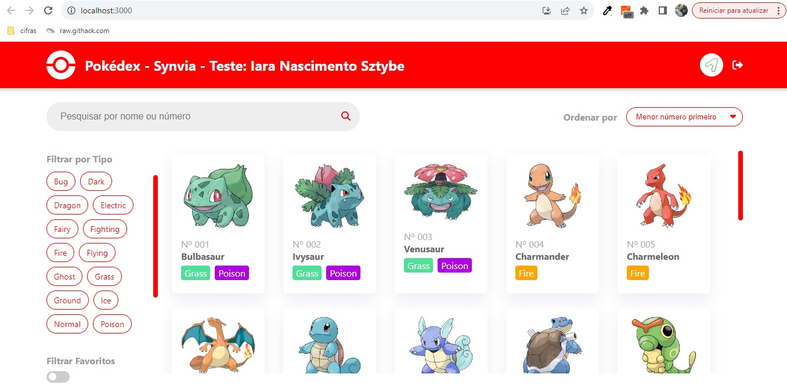
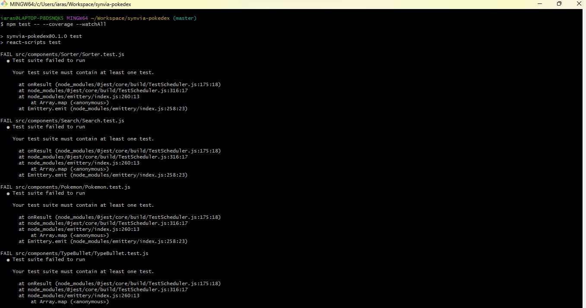
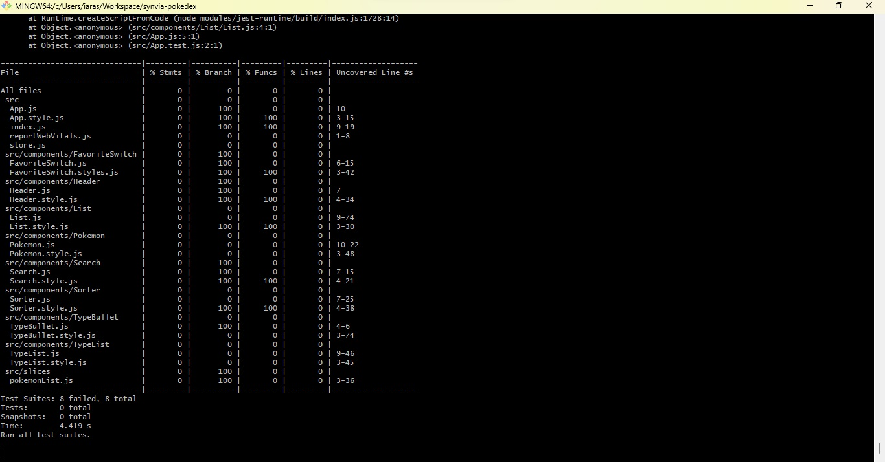
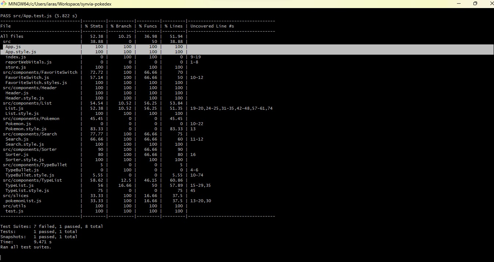
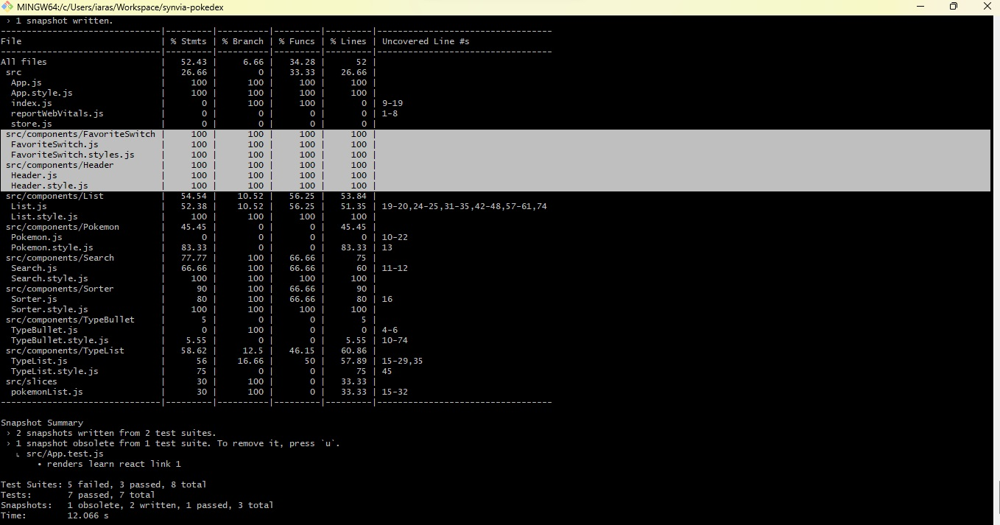

# Teste Synvia Pokedex - Iara Nascimento Sztybe

Esse projeto foi iniciado dia 03/11/2023, às 21h.

### Comandos

- `npm start`: modo desenvolvedor na porta 3000;
- `npm test`: roda os testes;
- `npm run build`: constrói a versão de produção na pasta build.

### Ações iniciais

- Projeto gerado com o comando `npx create-react-app synvia-pokedex`.
- Styled Components instalado com o comando `npm install styled-components --save`.
- Comandos do projeto listados no README.
- Configuração do projeto no GitHub e no Vercel.

### Etapa 1 - Lista

Para construir as funcionalidades da primeira etapa, foram feitas as ações abaixo.

- Axios instalado com o comando `npm install axios --save`.
- Foi criada a pasta "components" e, na mesma, o componente de lista (List.js).
- O componente de App.js foi refatorado para importar a lista.
- A requisição com axios para URL solicitada no projeto foi adicionada na lista.

- Foi criado um componente de exibição de pokemon para a listagem (Pokemon.js).
- Para completar a exibição, foi criado o componente de marcação de tipo (Type.js).

Aqui notei que alguns pokemons não estão exibindo a imagem e que alguns estão duplicados por conta do tipo. Então mais pra frente vou tentar ver uma forma de tratar isso, primeiramente vou tentar finalizar o desafio a tempo.

- Para fazer a mecânica de favorito, decidi utilizar redux na persistência de dados. Então instalei a biblioteca com o comando `npm install react-redux --save`.
- Redux aplicado para a listagem de pokemons já com a funcionalidade de favoritar.
- Foram adicionadas bibliotecas de icones do font-awesome.

- Estilizado barra de rolagem da listagem

### Etapa 2 - Filtros

- Criando componente de busca com campo de entrada que filtra os pokemons por nome ou número (Search.js).
- Adicionando filtros no redux e fazendo a busca pelo nome ou número do pokemon.

- Adicionando componente de listagem de filtros com função de filtrar por tipo (TypeList.js).
- Algumas mudanças de nomes e estilos para adaptar aos novos componentes.

- Implentando filtro de favorito (toggle/switch) com respectiva lógica no redux. Aqui foi usado como referência do w3schools (https://www.w3schools.com/howto/howto_css_switch.asp) para os estilos.

- Criado um novo elemento com respectivo redux para lidar com a ordenação dos pokemons (Sorter.js).
- A função de ordenação foi pega da web (https://stackoverflow.com/questions/1129216/sort-array-of-objects-by-string-property-value/16174180#comment2298229_1129270).
- Foi feita uma função para pegar apenas a primeira ocorrência do pokemon, assim evitando duplicados.

### Etapa 3 - Header

- Cabeçalho vermelho adicionado com as imagens passadas no desafio.

### Etapa 4 - Testes

Aqui tive que tomar a decisão de tratar as imagens e os pokemons que ocultei (duplicação) ou fazer os testes unitários. Acredito que consigo realizar ambas as coisas, mas por segurança vou optar por qual priorizar.

Se fosse "no mundo real" eu deixaria a funcionalidade redonda primeiro. Mas como nesse teste está claro que será avaliada minhas habilidades com testes, optei por faze-los primeiro.

- Rodando comando de análise de cobertura (`npm test -- --coverage --watchAll`).

- Alterando algumas configurações para executar os testes.
- Desenvolvendo App.test.js para cobrir App.js.

- Recolocando babel no projeto para executar build.
- Refatorando testes de App.
- Alterando novamente algumas configurações dos testes.
- Criando teste de FavoriteSwitch.
- Criando teste do Header.

- Implementando teste das funções úteis do componente List.
